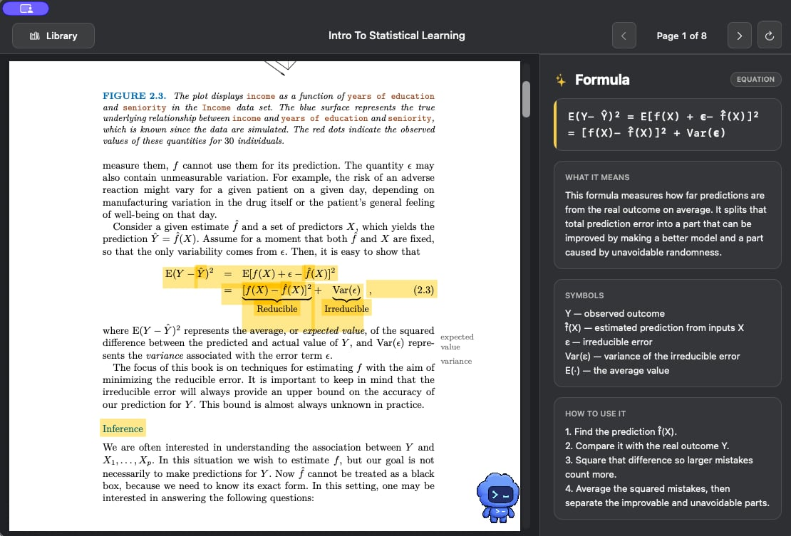

# Axiom Prototype

A native macOS textbook reader that extracts PDF metadata locally and highlights important text on demand.



## What it does

- Opens with a textbook library instead of immediately showing a file picker.
- Initializes the library from a selected folder and recursively discovers its PDFs.
- References local PDFs without copying or modifying the originals.
- Extracts and fingerprints every page locally with PDFKit when a textbook is added.
- Uses OpenAI by default to identify definitions, theorems, lemmas, corollaries, equations, notation, and core concepts, with Gemini available as a fallback.
- Calls AI only for the current page after the reader scrolls to it.
- Caches page results in SQLite so the same unchanged page is not analyzed twice.
- Adds yellow highlight annotations directly on top of important text and keeps the right sidebar.

PDF text itself is not rewritten in-place. This prototype adds visual yellow PDF annotations over text that the configured AI considers important.

## Run it

1. Create a local `.env` file:

```bash
cp .env.example .env
```

2. Configure OpenAI as the default provider:

```env
AI_PROVIDER=openai
OPENAI_API_KEY=your_openai_api_key_here
OPENAI_MODEL=gpt-5.2
```

3. Start Axiom:

```bash
swift run Axiom
```

4. Choose **Add Folder** or press `Command-O`, then select the bundled `mock-data` folder.

5. Open `Intro_to_Statistical_Learning.pdf` and pause on a page to try AI highlighting.

If the OpenAI API fails, replace the AI settings in `.env` with the Gemini configuration below, then restart Axiom:

```env
AI_PROVIDER=gemini
GEMINI_API_KEY=your_gemini_api_key_here
GEMINI_MODEL=gemini-3.1-flash-lite
```

Shell environment variables override `.env` values. If the selected provider's API key is missing, local metadata extraction still works and the reader explains why AI highlighting is unavailable. Failed pages can be retried independently.

This SwiftPM prototype is not packaged as a Finder-registered `.app` yet. Double-clicking a PDF in Finder will still open your default PDF app.

## Development with Codex and GPT-5.6

Axiom was developed with Codex powered by GPT-5.6 as a coding collaborator. This is a development-time integration, not a runtime dependency: GPT-5.6 helped the team inspect the repository, plan changes, edit Swift code, review diffs, run verification, and maintain the technical documentation. The shipped app remains a normal Swift executable and sends page-analysis requests only to the OpenAI or Gemini provider configured by the user.

Codex accelerated the workflow by keeping exploration, implementation, and verification in one loop. It traced behavior across AppKit, PDFKit, SQLite, and the provider adapters; applied coordinated changes across those layers; and checked the result with `swift run Axiom --verify`. This reduced the time spent manually locating related code and repeating build-review-fix cycles. No numerical speedup is claimed.

The team retained the key product and architecture decisions:

- Use a native, single-process macOS app for direct PDFKit integration.
- Keep PDF discovery, text extraction, fingerprints, and cache lookup local.
- Send only the uncached, currently visible page to the selected AI provider.
- Preserve original PDFs by rendering temporary annotations instead of rewriting files.
- Key cached results by page text, provider, model, and prompt version.
- Use OpenAI as the first runtime provider and Gemini as a manual fallback.

Codex helped turn those decisions into implementation and verification steps, but the team decided the scope, privacy boundary, provider strategy, and final user experience. The detailed trade-offs are recorded in [the system design](docs/system-design.md#13-architectural-decisions-and-trade-offs), and the staged development work is recorded in [the branch plan](docs/branches/README.md).

## Metadata storage

Axiom stores textbook, page, highlight, concept, and analysis-job metadata in:

```text
~/Library/Application Support/Axiom/axiom.sqlite3
```

The original PDFs remain in their existing filesystem locations.

## System design

See [docs/system-design.md](docs/system-design.md) for the code-backed architecture, data model,
runtime flows, cache rules, concurrency model, failure handling, and system diagrams.

## Verification

Run the non-GUI fixture and cache checks with:

```bash
swift run Axiom --verify
```

## Uninstall

See [UNINSTALL.md](UNINSTALL.md) for steps to remove the metadata database, caches, logs, API-key file, build output, and source checkout.

## Debug logging

When running from the project folder, Axiom writes logs to:

```text
axiom.log
```

The same logs also print in the terminal used for `swift run`. Logs include provider selection, model name, request status, response snippets, JSON decode failures, fallback reasons, and highlight counts. API keys are redacted.
