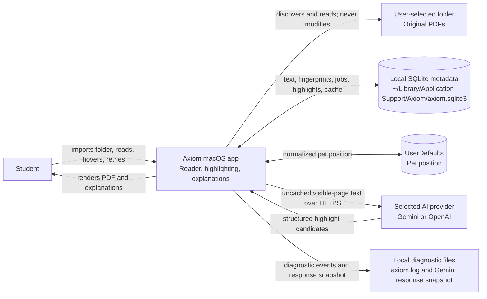
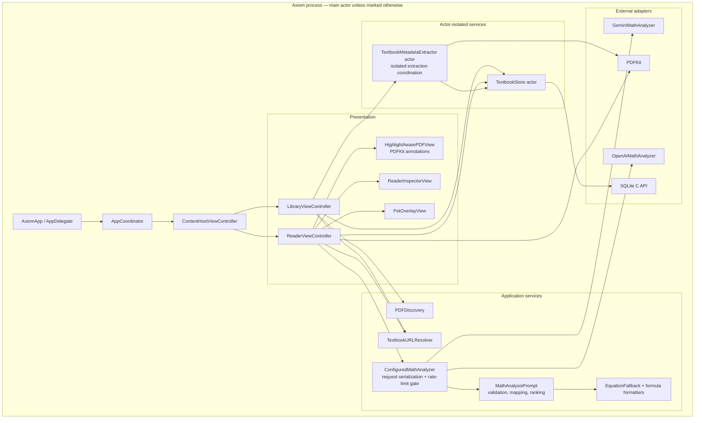
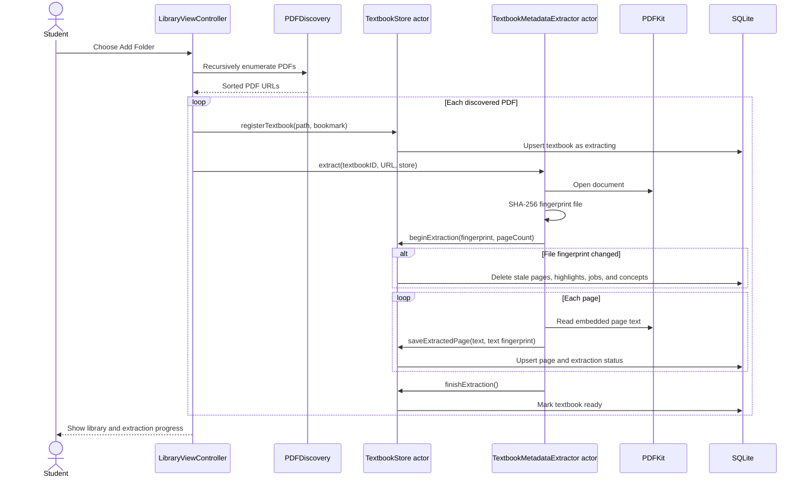
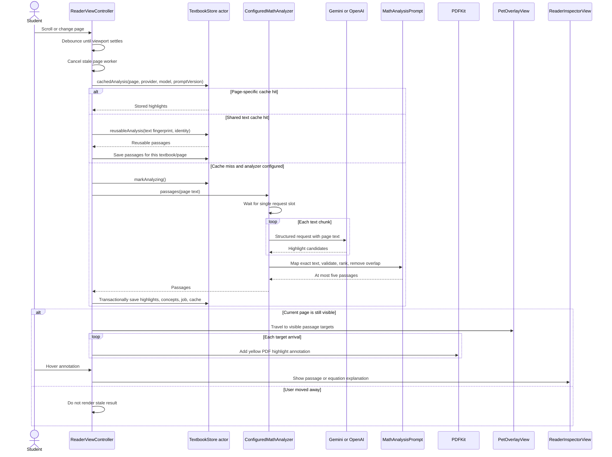
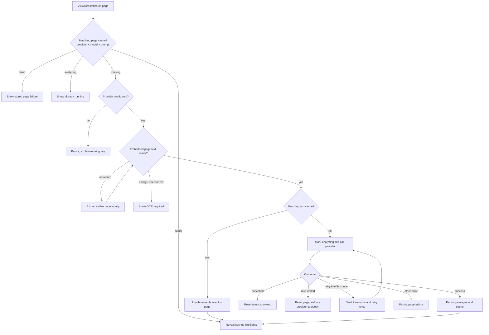
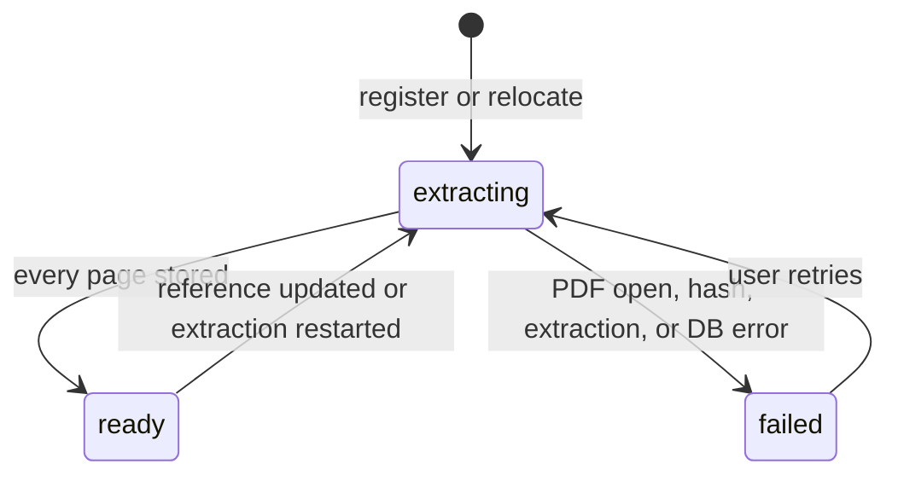
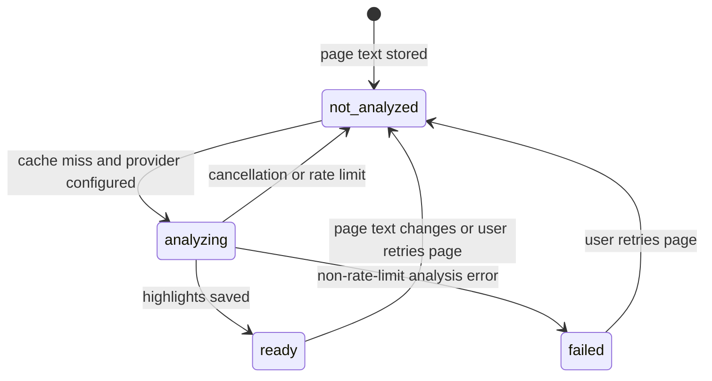
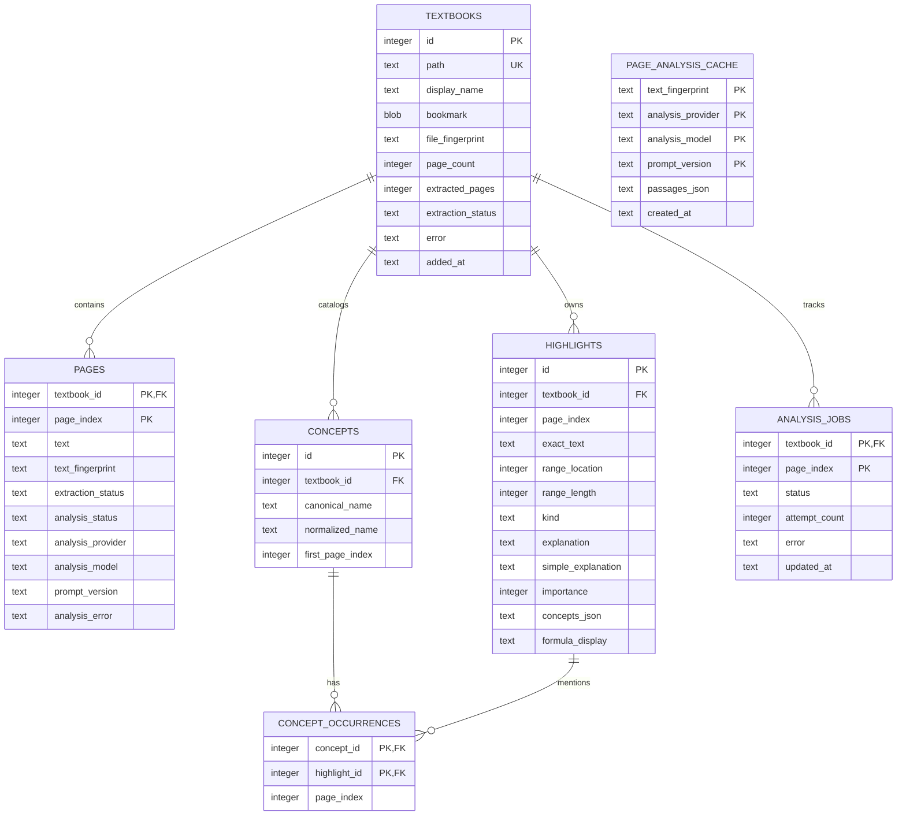
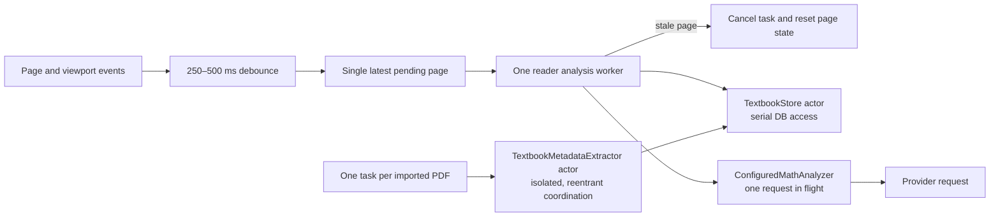
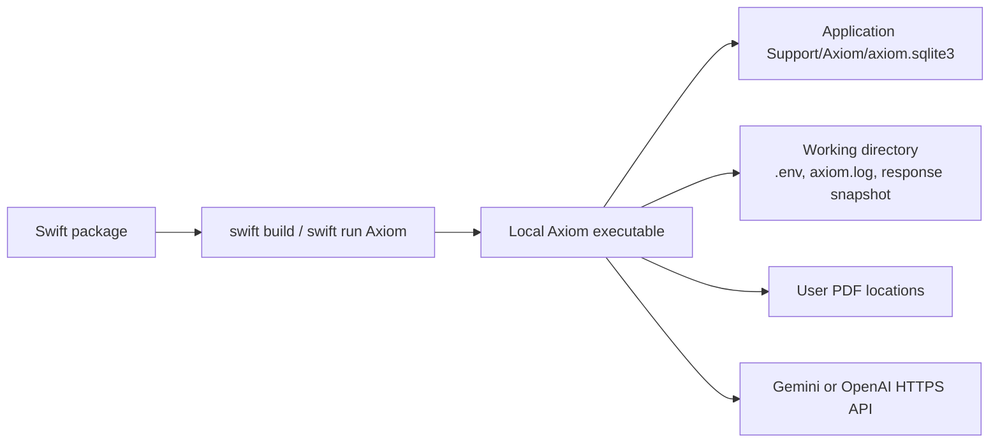

# Axiom system design

This document describes the architecture implemented in the current repository. It is a
code-backed description of the prototype, not a roadmap. Future capabilities are called out
explicitly.

## 1. System summary

Axiom is a single-user, native macOS textbook reader. It discovers PDFs in a user-selected
folder, extracts page text locally with PDFKit, stores metadata and AI results in SQLite, and
analyzes only the visible page after scrolling settles. The returned passages are mapped back
to exact PDF text ranges and rendered as temporary PDF highlight annotations. Hovering a
highlight opens a short explanation in the inspector.

The application is a single Swift executable. There is no Axiom application server, account
system, sync service, or background daemon.

### Design goals

- Preserve the original PDF: Axiom references it in place and does not rewrite or copy it.
- Keep ingestion local: discovery, text extraction, hashing, and cache lookup happen on-device.
- Limit remote data and cost: only uncached text for the settled visible page is sent to the
  selected AI provider.
- Make results reproducible: cached analysis is keyed by page text, provider, model, and prompt
  version.
- Keep reading responsive: page work is debounced, stale analysis is cancelled, and storage and
  extraction use Swift actors.
- Fail per page: missing configuration, rate limits, OCR needs, and provider errors do not make
  the rest of the library unusable.

### Technology profile

| Concern | Current choice |
| --- | --- |
| Platform | macOS 13 or later |
| Language/build | Swift 6, Swift Package Manager |
| UI | AppKit |
| PDF access/rendering | PDFKit |
| Persistence | SQLite 3 with foreign keys and WAL |
| Concurrency | Swift structured concurrency and actors |
| Networking | `URLSession` |
| AI providers | Gemini Interactions API or OpenAI Responses API |
| Fingerprints | SHA-256 via CryptoKit |
| Pet animation | AppKit, QuartzCore, bundled WebP sprite sheet |
| Verification | `swift run Axiom --verify` |

## 2. System context



### Trust and data boundaries

1. **User filesystem:** PDFs stay at their original paths. Security-scoped bookmarks allow the
   sandboxed app to reopen selected files.
2. **Local application data:** extracted page text, fingerprints, highlight explanations, and
   job state are stored in SQLite. Pet position is stored in `UserDefaults`.
3. **Remote provider:** when a page has no valid cache entry, its extracted text and prompt are
   sent to the configured provider. The request explicitly disables Gemini response storage;
   provider-side handling is otherwise governed by that provider.
4. **Local diagnostics:** logs contain request status, timing, response snippets on failures, and
   a Gemini response snapshot. API keys are redacted in application log messages.

## 3. Runtime architecture



### Component responsibilities

| Component | Responsibility | Does not own |
| --- | --- | --- |
| `AppDelegate` | Create the window and application menu; start coordination | Reading or persistence rules |
| `AppCoordinator` | Switch between library and reader; share store, extractor, and analyzer | Page-processing state |
| `LibraryViewController` | Folder selection, recursive PDF discovery, registration, extraction progress, search, remove/locate flows | PDF text extraction |
| `ReaderViewController` | Visible-page scheduling, cache decision tree, analysis lifecycle, annotations, hover inspector, pet orchestration | SQL or provider request encoding |
| `TextbookMetadataExtractor` actor | Open a PDF, hash the file, extract all page text, report progress/failure | AI analysis |
| `TextbookStore` actor | SQLite schema, transactions, cache identity, jobs, concepts, and CRUD | Rendering |
| `ConfiguredMathAnalyzer` | Choose provider, serialize requests, apply rate-limit cooldown, chunk pages, map results | Durable caching |
| Provider adapters | Encode HTTPS requests and decode structured provider responses | Highlight selection policy |
| `MathAnalysisPrompt` | Prompt contract, exact-text matching, validation, de-duplication, overlap removal, ranking, maximum of five highlights | Network transport |
| `PetOverlayView` | Animation, highlight travel, dragging, reduce-motion behavior, saved position | Analysis decisions |

## 4. Primary flows

### 4.1 Import and local extraction



Important behavior:

- Folder discovery is recursive, skips hidden files and packages, and accepts `.pdf`
  case-insensitively.
- A full-file SHA-256 fingerprint detects a replaced PDF.
- A normalized page-text SHA-256 fingerprint invalidates only analysis tied to changed text and
  enables reuse when the same page text occurs in another PDF.
- A page with no embedded text is stored as `needs_ocr`; OCR is not implemented.
- The UI may extract a missing visible page on demand if the full import has not stored it yet.

### 4.2 Visible-page analysis and highlighting



### Page decision tree



## 5. State model

### 5.1 Textbook extraction



### 5.2 Page analysis



The stored provider, model, and prompt version are part of the effective analysis state. A
`ready` row with a different identity is treated as a cache miss without first mutating the row.

## 6. Persistence design



`PAGE_ANALYSIS_CACHE` is deliberately independent of a textbook foreign key. This allows
identical normalized page text to reuse the same analysis across files. The cached JSON stores
text ranges, so reuse is safe only because the cache key is the normalized text fingerprint.

### Cache layers and invalidation

| Layer | Key | Value | Invalidated when |
| --- | --- | --- | --- |
| Page analysis | textbook ID + page index, then identity check | Normalized highlight rows | Page text, provider, model, prompt version, or explicit retry changes |
| Shared analysis | page text fingerprint + provider + model + prompt version | JSON passages | Its composite identity changes; current implementation does not evict by age |
| Rendered annotations | current in-memory PDF page + range/kind key | Temporary `PDFAnnotation` objects | Page refresh, retry, controller lifetime, or explicit removal |

`Retry Page` clears the page-specific state and annotations, but it does not remove the matching
shared text-cache entry. For a previously successful page, the current implementation will
normally reattach that shared result instead of making a fresh provider request.

### Transaction boundaries

- Replacing a changed textbook deletes dependent page analysis in one immediate transaction.
- Saving an analysis replaces page highlights, updates concepts and occurrences, marks the page
  and job complete, and commits them together.
- The reusable page cache is saved immediately after the page transaction, not inside it. If that
  final write fails, the highlight rows may already be durable; the caller then records the page
  as failed, so the user must retry.

## 7. AI analysis contract

The analysis pipeline has four layers:

1. **Chunking:** page text is split at paragraph or line boundaries when it exceeds 18,000
   characters.
2. **Structured generation:** the provider must return JSON matching the highlight schema.
3. **Grounding:** every `exact_text` must map back to the extracted page text. Matching first uses
   direct comparison, then whitespace-flexible matching, then a conservative prose fallback.
4. **Selection:** malformed equations, broad prose, duplicates, and overlapping ranges are
   removed. Remaining candidates are ranked by importance and semantic kind, capped at five, and
   returned in page order.

If the provider omits a central displayed equation, a deterministic local fallback can recover a
bounded equation-like span from the extracted text. AI-supplied `display_formula` is presentation
data only; the original extracted range remains the annotation source of truth.

### Provider selection

- `AI_PROVIDER=openai` selects OpenAI.
- Otherwise Gemini is the default, except that OpenAI is selected automatically when no provider
  is named, only the OpenAI key is configured, and the Gemini key is not.
- Environment variables override `.env`.
- The default model names are configuration values, not architectural guarantees.

## 8. Concurrency and scheduling



- AppKit and the reader/analyzer adapters are main-actor isolated.
- `TextbookStore` serializes SQLite access and owns its connection.
- `TextbookMetadataExtractor` protects its actor-isolated execution, but `extract` awaits the
  store once per page. Actor reentrancy means separate PDF import tasks may interleave at those
  suspension points; extraction is not guaranteed to be globally serial.
- The reader keeps at most one active worker and one latest pending page.
- The analyzer maintains one provider request in flight; waiters resume FIFO.
- Cancellation is checked around viewport changes and before rendering. URLSession cancellation
  propagates through the analysis task.

This design prioritizes predictable UI and API usage over provider throughput. Storage and remote
analysis are serialized, while separate PDF imports can make interleaved progress.

## 9. Failure handling and recovery

| Failure | Stored state | User experience | Recovery |
| --- | --- | --- | --- |
| Missing API key | No analysis mutation | Inspector says AI is paused | Configure `.env` and revisit/retry |
| No embedded PDF text | `needs_ocr` | Inspector says OCR is required | No in-app recovery yet |
| Provider 429 | Page reset to `not_analyzed`; analyzer cooldown set | Rate-limit message | Retry after cooldown |
| Provider 5xx | `analyzing` during one delayed retry | Analyzing state | Automatic retry once after 2 seconds |
| Other provider/decode error | Page and job marked `failed` | Failed state with retry action | Explicit Retry Page |
| User changes page mid-request | Page reset to `not_analyzed` | New visible page takes priority | Revisit old page later |
| App exits during analysis | May leave `analyzing`/`processing` | None during exit | Startup resets interrupted work |
| PDF path unavailable | Textbook metadata remains | Locate flow or unavailable message | Re-select the PDF |
| PDF contents changed | Old dependent metadata deleted | Re-extraction progress | Automatic rebuild |

## 10. Security and privacy

### Existing controls

- Original PDF files are read-only from Axiom's perspective.
- Security-scoped bookmarks persist permission to user-selected PDFs.
- API keys are read from process environment or local `.env`; keys are redacted in log messages.
- Provider calls use HTTPS.
- SQLite foreign keys and transactions preserve relationship integrity.
- Provider/model/prompt identities prevent silent reuse of semantically incompatible results.

### Known risks and recommended hardening

1. `.env` is plaintext. A packaged app should store credentials in macOS Keychain.
2. Extracted textbook text and AI explanations are plaintext in SQLite.
3. Failed HTTP response snippets and the full latest Gemini response can be written locally.
   Production logging should be opt-in, bounded, and scrubbed; response snapshots should not be
   enabled by default.
4. Page text leaves the device on a cache miss. The UI should disclose the selected provider and
   remote-processing boundary before the first request.
5. There is no database retention or shared-cache eviction policy.
6. This SwiftPM executable is not yet a signed, hardened, sandbox-entitled `.app` distribution.

## 11. Performance characteristics

- **Import:** `O(total PDF bytes + total pages + total extracted text)`. The full file is read once
  for its fingerprint and each page once for text extraction.
- **Page lookup:** primary-key SQLite lookup plus an indexed highlight lookup.
- **Shared cache:** one composite primary-key lookup.
- **Highlight rendering:** proportional to selected passages and their PDF line fragments, capped
  at five passages per page.
- **Hover hit testing:** currently scans every auto-highlight annotation on every document page.
  This is simple but can become expensive for large books; indexing annotations by visible page
  is the clearest next optimization.
- **Database growth:** extracted text scales with all imported pages; the shared analysis cache
  grows without automatic eviction.

## 12. Deployment and operations



Operational commands:

```bash
swift run Axiom
swift run Axiom --verify
```

The verification mode covers text fingerprints, highlight filtering and equation fallback,
SQLite cache identity and reuse, local PDF import, and the pet animation/positioning contract.

## 13. Architectural decisions and trade-offs

| Decision | Benefit | Cost / limitation |
| --- | --- | --- |
| Native single process | Simple deployment and direct PDFKit integration | macOS-only; UI and orchestration are tightly coupled |
| PDFs referenced in place | No duplicate books or destructive rewrite | Broken paths require relocation; permission bookmarks matter |
| Local full-text extraction | Fast page access and cacheability | Stores textbook text in plaintext and requires disk space |
| Analyze visible page only | Lower latency, cost, and data disclosure | No ahead-of-time results; rapid navigation can cancel work |
| Exact-text grounding | Highlights align with the source PDF | PDF extraction order and math typography make mapping difficult |
| SQLite actor | Clear ownership and safe serial access | One connection and serialized operations limit throughput |
| Shared text-fingerprint cache | Reuses identical content across PDFs | Unbounded cache; identity and normalization must remain stable |
| Provider abstraction with two adapters | Configuration flexibility | Provider response parsing and behavior can still differ |
| Temporary PDF annotations | Original remains unchanged | Highlights are recreated from metadata rather than embedded |
| One remote request at a time | Predictable quotas and cancellation | Long pages/imported navigation cannot analyze concurrently |

## 14. Current constraints and evolution points

These are natural extension seams, not implemented features:

- Add OCR behind `TextbookMetadataExtractor` for `needs_ocr` pages.
- Move secrets to Keychain and diagnostic output to an opt-in support bundle.
- Separate reader orchestration from `ReaderViewController` into a testable page-analysis service.
- Index rendered annotations by page to remove whole-document hover scans.
- Add cache size/age policy and database maintenance.
- Package, sign, notarize, and sandbox the macOS application.
- Add persistent chat or retrieval only after defining its scope, citations, indexing, privacy
  boundary, and independent cache model.

## 15. Source map

| Area | Source |
| --- | --- |
| Entry point | `Sources/Axiom/main.swift` |
| Window, library, reader, annotations, inspector | `Sources/Axiom/AppUI.swift` |
| Domain and cache models | `Sources/Axiom/Models.swift` |
| AI prompt, mapping, fallback, and provider adapters | `Sources/Axiom/MathAnalysis.swift` |
| SQLite schema and repository | `Sources/Axiom/TextbookStore.swift` |
| PDF hashing and local extraction | `Sources/Axiom/TextbookMetadataExtractor.swift` |
| Pet state, animation, travel, and persistence | `Sources/Axiom/PetOverlay.swift` |
| Environment, logging, and PDF discovery | `Sources/Axiom/Support.swift` |
| Executable verification suite | `Sources/Axiom/Verification.swift` |
| Build configuration | `Package.swift` |
